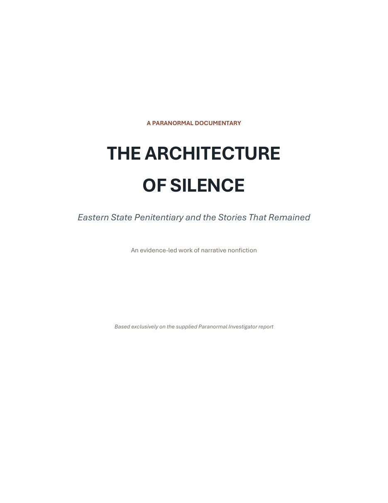
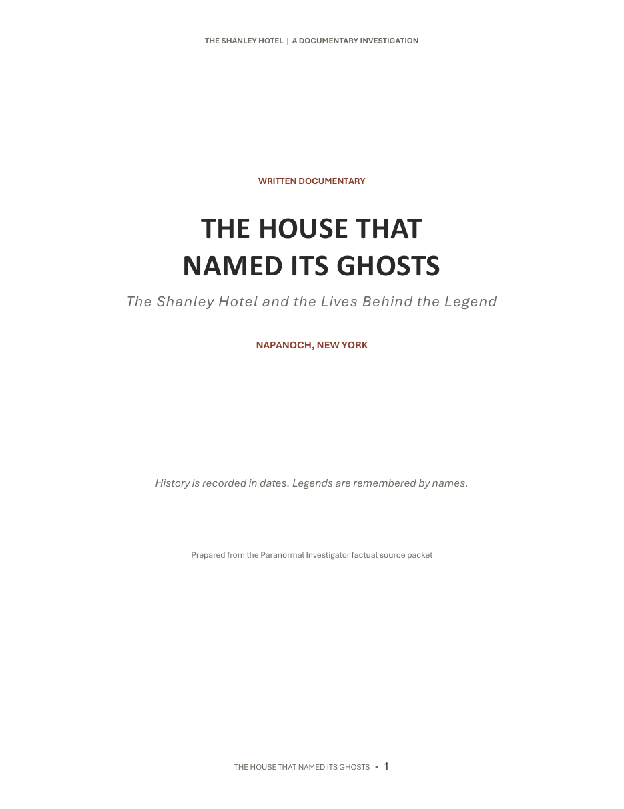

# The Haunted Archives

*Documented history. Reported encounters. The space between them.*

**2 investigations · 35 pages · 2 historic locations**

The Haunted Archives is a collection of evidence-led paranormal narrative nonfiction. Each documentary examines a location's documented history, reported encounters, folklore, and possible natural explanations without presenting paranormal interpretation as established fact.

## Documents

<table>
  <tr>
    <td width="230" align="center">
      
    </td>
    <td>
      <h3>The Architecture of Silence</h3>
      
<strong>Eastern State Penitentiary · Philadelphia · 19 pages</strong>

      
Examines the penitentiary's history, architecture, reported encounters, investigative methods, and the development of its haunted reputation.

      
<a href="./The%20Architecture%20of%20Silence.pdf"><strong>Read the documentary →</strong></a>

    </td>
  </tr>
  <tr>
    <td width="230" align="center">
      
    </td>
    <td>
      <h3>The House That Named Its Ghosts</h3>
      
<strong>The Shanley Hotel · Napanoch, New York · 16 pages</strong>

      
Investigates the lives, legends, named spirits, witness accounts, and experimental methods associated with the hotel.

      
<a href="./The%20House%20That%20Named%20Its%20Ghosts.pdf"><strong>Read the documentary →</strong></a>

    </td>
  </tr>
</table>

## Editorial Approach

> **The suffering is documented. The haunting is reported.**

The documentaries distinguish among different kinds of evidence:

- Documented history is presented as fact.
- Eyewitness accounts are treated as testimony.
- Folklore and urban legends are identified as such.
- Paranormal interpretations remain claims rather than conclusions.
- Natural explanations are considered as hypotheses, with the same caution applied to them.

The aim is to preserve the mystery of each location while keeping the boundary between the historical record and supernatural interpretation visible.

## Reading the Archive

Select a documentary in the table above to view it on GitHub. From the document page, use the download control if you prefer to read the original PDF locally.
